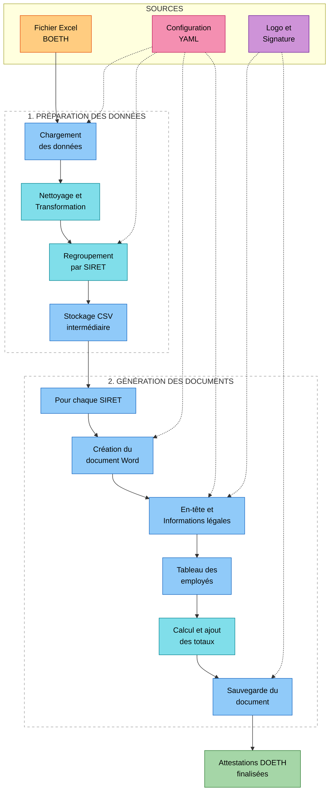
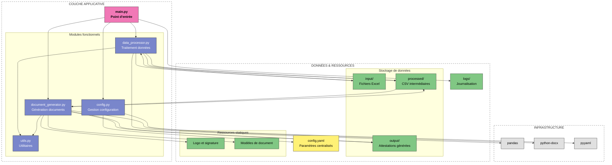

# Publipostage DOETH - Documentation

## Sommaire

1. [Vue d'ensemble](#vue-densemble)
   - [Description](#description)
   - [Fonctionnalités clés](#fonctionnalités-clés)
2. [Installation](#installation)
   - [Prérequis](#prérequis)
   - [Étapes d'installation](#étapes-dinstallation)
   - [Vérification](#vérification-de-linstallation)
3. [Configuration](#configuration)
   - [Structure de configuration](#structure-de-configuration)
   - [Environnements](#configuration-des-environnements)
   - [Format des fichiers d'entrée](#format-des-fichiers-dentrée)
4. [Architecture](#architecture)
   - [Structure du projet](#structure-du-projet)
   - [Flux de traitement](#flux-de-traitement)
   - [Composants principaux](#composants-principaux)
   - [Architecture Fonctionnelle](#architecture-fonctionnelle)
   - [Architecture Technique](#architecture-technique)
5. [Utilisation](#utilisation)
   - [Démarrage rapide](#démarrage-rapide)
   - [Options en ligne de commande](#options-en-ligne-de-commande)
   - [Résultats générés](#résultats-générés)
   - [Journalisation](#journalisation)
6. [Développement](#développement)
   - [Bonnes pratiques](#bonnes-pratiques)
   - [Gestion des erreurs](#gestion-des-erreurs)
   - [Extensibilité](#extensibilité)
7. [Maintenance](#maintenance)
   - [Dépannage](#guide-de-dépannage)
   - [Contact](#contact)

## Vue d'ensemble

### Description

Publipostage DOETH est une application Python conçue pour automatiser la génération d'attestations DOETH (Déclaration Obligatoire d'Emploi des Travailleurs Handicapés) à partir de fichiers Excel. L'application traite les données, effectue des regroupements par SIRET, et produit des documents Word formatés professionnellement. Elle est spécialement adaptée aux besoins du Groupe Interaction pour la gestion des attestations DOETH destinées aux clients et aux agences.

### Fonctionnalités clés

- Nettoyage et transformation automatique des données Excel
- Regroupement intelligent des employés par SIRET
- Génération automatique d'attestations Word professionnelles
- Formatage personnalisé pour une présentation optimale
- Gestion avancée des erreurs avec journalisation détaillée
- Architecture modulaire et extensible
- Support multi-environnements (Production, Développement, Test)
- Intégration du logo et de la signature

## Installation

### Prérequis

- Python 3.8 ou supérieur
- Bibliothèques Python requises :
  - pandas
  - openpyxl
  - python-docx
  - pyyaml
  - colorama

### Étapes d'installation

1. Cloner le dépôt :
```bash
git clone [URL_REPO]
cd publipostage_doeth
```

2. Créer et activer l'environnement virtuel :
```bash
python -m venv venv

# Windows
venv\Scripts\activate

# Linux/MacOS
source venv/bin/activate
```

3. Installer les dépendances :
```bash
pip install -r requirements.txt
```

### Vérification de l'installation

Pour vérifier que l'installation est correcte, exécutez :

```bash
python main.py --version
```

## Configuration

### Structure de configuration

La configuration de l'application est définie dans le fichier `config/config.yaml`. Cette structure modulaire permet de facilement adapter l'application à différents besoins :

```yaml
# Configuration Publipostage DOETH
paths:
  base_dir: __BASE_DIR__
  data_dir: ${paths.base_dir}/data
  resources_dir: ${paths.base_dir}/resources
  logs_dir: ${paths.base_dir}/logs
  input_dir: ${paths.data_dir}/input
  processed_dir: ${paths.data_dir}/processed
  output_dir: ${paths.data_dir}/output

resources:
  logo_path: ${paths.resources_dir}/images/Entete_GI.png
  signature_path: ${paths.resources_dir}/images/RL_LG.png

defaults:
  input_filename: "Liste des BOETH par RGP CLI avec adresses.xlsx"
  excel_sheet: "Feuil1"
  csv_separator: ";"
  date_format: "%d/%m/%Y"

document:
  font_size: 10
  table_font_size: 8
  paragraph_spacing: 4
  margins:
    top: 1.0
    bottom: 1.0
    left: 1.5
    right: 1.5
  logo_width: 4.0
  signature_width: 4.5
  title: "Attestation relative aux travailleurs en situation d'handicap mis à disposition par une entreprise de travail temporaire ou un groupement d'employeurs"
  city: "Rennes"

representant:
  nom: "Loïc GALLERAND"
  adresse: "233 rue de Châteaugiron à Rennes (35000)"
  siret: "49342093900057"

logging:
  console_level: "INFO"
  file_level: "DEBUG"
  max_bytes: 10485760
  backup_count: 10
  enable_colors: true
```

### Configuration des environnements

L'application détecte automatiquement l'environnement d'exécution basé sur le nom d'hôte de la machine ou les variables d'environnement. Chaque environnement peut avoir sa propre configuration via les fichiers `.env.prod`, `.env.develop` et `.env.test` dans le répertoire `config`.

### Format des fichiers d'entrée

Les fichiers d'entrée doivent respecter les critères suivants :

- Format Excel (XLSX) contenant les données BOETH
- Structure de colonnes respectant le format attendu
- Encodage UTF-8

## Architecture

### Structure du projet

```
publipostage_doeth/
│
├── config/                     # Configuration
│   └── config.yaml            # Configuration principale
│
├── data/                       # Données
│   ├── input/                 # Fichiers Excel à traiter
│   ├── processed/             # Fichiers CSV intermédiaires
│   └── output/                # Attestations générées
│
├── logs/                       # Journaux d'application
│
├── resources/                   # Ressources statiques
│   ├── images/                # Images (logo, signature)
│   └── templates/             # Modèles de documents
│
├── src/                        # Code source
│   ├── __init__.py
│   ├── config.py              # Gestion de configuration
│   ├── data_processor.py      # Traitement des données Excel
│   ├── document_generator.py  # Génération des attestations
│   └── utils/                 # Utilitaires
│       ├── __init__.py
│       ├── logger.py          # Configuration logs
│       └── error_handling.py  # Gestion des erreurs
│
├── requirements.txt            # Dépendances
├── README.md                   # Documentation
└── main.py                     # Point d'entrée
```

### Flux de traitement

1. **Initialisation** : Chargement de la configuration et configuration des logs
2. **Traitement des données** :
   - Chargement du fichier Excel source
   - Nettoyage et transformation des données
   - Création de la colonne SIRET (combinaison SIREN et NIC)
   - Regroupement et agrégation par SIRET
   - Filtrage des données (exclusion des "DIFFUS")
   - Ajout des colonnes de traitement (NOUVEAU_GROUPE, FIN_GROUPE)
   - Sauvegarde en format CSV intermédiaire
3. **Génération des attestations** pour chaque SIRET :
   - Création d'un document Word
   - Ajout du logo et des informations d'en-tête
   - Ajout des informations légales et du représentant
   - Création du tableau des employés
   - Calcul des totaux
   - Ajout du pied de page et de la signature
   - Sauvegarde de l'attestation
4. **Finalisation** : Journalisation des résultats et nettoyage

### Composants principaux

- **ConfigManager** : Gestion de la configuration et des environnements
- **DataProcessor** : Traitement et transformation des données Excel
- **DocumentGenerator** : Création des attestations Word
- **Logger** : Journalisation avec niveaux et rotation des logs

### Architecture Fonctionnelle



### Architecture Technique



## Utilisation

### Démarrage rapide

1. Placer le fichier Excel à traiter dans le répertoire `data/input/`
2. Exécuter l'application :

```bash
python main.py
```

3. Consulter les attestations générées dans le répertoire `data/output/`

### Options en ligne de commande

L'application dispose de plusieurs options en ligne de commande :

```bash
# Afficher l'aide
python main.py --help

# Mode debug avec logs détaillés
python main.py --debug

# Utilisation d'un fichier Excel spécifique
python main.py --input "chemin/vers/mon_fichier.xlsx"

# Ignorer le traitement Excel et utiliser un CSV existant
python main.py --skip-processing --csv-path "chemin/vers/donnees_traitees.csv"
```

### Résultats générés

- **Fichiers CSV intermédiaires** : Données traitées et regroupées
  - Emplacement : `data/processed/`
  - Nom : `processed_YYYYMMDD_HHMMSS.csv`

- **Attestations DOETH** : Documents Word formatés
  - Emplacement : `data/output/`
  - Nom : `Attestation_<SIRET>.docx`
  - Contenu : En-tête, informations légales, tableau des employés, totaux, signature

### Journalisation

L'application utilise un système de journalisation avancé :

- **Logs console** : Affichage en temps réel avec code couleur
- **Logs fichier** : Enregistrement détaillé dans `logs/`
- **Rotation automatique** : Gestion des fichiers volumineux
- **Niveaux configurables** : Ajustement de la verbosité selon l'environnement

Exemple de log :
```
2025-02-25 14:50:23 | INFO     | MainThread | Démarrage de l'application
2025-02-25 14:50:23 | INFO     | MainThread | Chargement du fichier Excel: data/input/Liste des BOETH par RGP CLI avec adresses.xlsx
2025-02-25 14:50:24 | INFO     | MainThread | Fichier Excel chargé avec succès: 150 lignes, 18 colonnes
2025-02-25 14:50:24 | INFO     | MainThread | Création de la colonne SIRET à partir de SIREN et NIC
2025-02-25 14:50:24 | INFO     | MainThread | Données regroupées: 23 SIRET uniques identifiés
2025-02-25 14:50:25 | INFO     | MainThread | Création de l'attestation pour SIRET: 12345678901234, Client: ACME SARL
```

## Développement

### Bonnes pratiques

Le code suit plusieurs bonnes pratiques pour assurer sa qualité :

1. **Modularité** : Séparation des responsabilités en composants distincts
2. **Type Hints** : Utilisation d'annotations de type pour améliorer la lisibilité
3. **Gestion d'erreurs** : Traitement robuste des exceptions
4. **Logging structuré** : Journalisation détaillée à plusieurs niveaux
5. **Configuration centralisée** : Paramètres externalisés dans des fichiers YAML

### Gestion des erreurs

Le système de gestion d'erreurs comprend :

- **Hiérarchie d'exceptions** : Exceptions spécialisées par type d'erreur
- **Journalisation contextualisée** : Détails sur l'erreur et son contexte
- **Récupération gracieuse** : Poursuite du traitement malgré les erreurs isolées
- **Débogage facilité** : Informations détaillées pour identifier les problèmes

### Extensibilité

Pour étendre les fonctionnalités :

1. **Personnalisation du formatage** : Modifier les paramètres dans la section `document` de la configuration
2. **Ajout de nouvelles sources de données** : Étendre le module `data_processor.py`
3. **Modèles d'attestation supplémentaires** : Créer de nouveaux templates dans `document_generator.py`
4. **Rapports personnalisés** : Ajouter une fonctionnalité de rapport dans un nouveau module

## Maintenance

### Guide de dépannage

**Erreur : "Fichier Excel non trouvé"**
- **Cause** : Le fichier d'entrée n'existe pas ou n'est pas accessible
- **Solution** : Vérifiez le chemin du fichier et les permissions d'accès

**Erreur : "Colonne SIREN manquante"**
- **Cause** : Le fichier Excel ne contient pas la colonne SIREN requise
- **Solution** : Vérifiez la structure de votre fichier d'entrée et assurez-vous qu'il contient toutes les colonnes nécessaires

**Erreur lors de la génération des attestations**
- **Cause** : Problème lors de la création ou de l'enregistrement des documents Word
- **Solution** : Vérifiez que le répertoire de sortie est accessible en écriture et que les chemins des ressources (logo, signature) sont corrects

### Contact

- **Auteur** : Mahamadou COULIBALY
- **Email** : mahamadou.coulibaly@interaction-groupe.com
- **Version** : 1.0.0
- **Dernière mise à jour** : Février 2025

---

© 2025 Groupe Interaction - Tous droits réservés